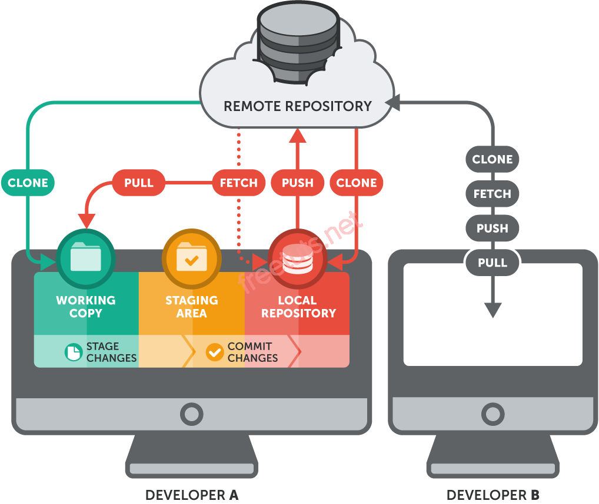
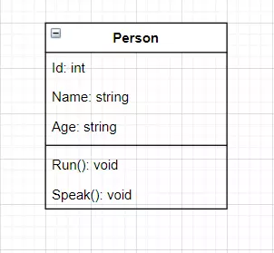
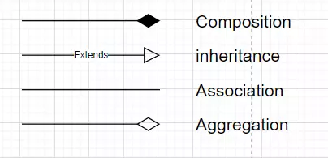
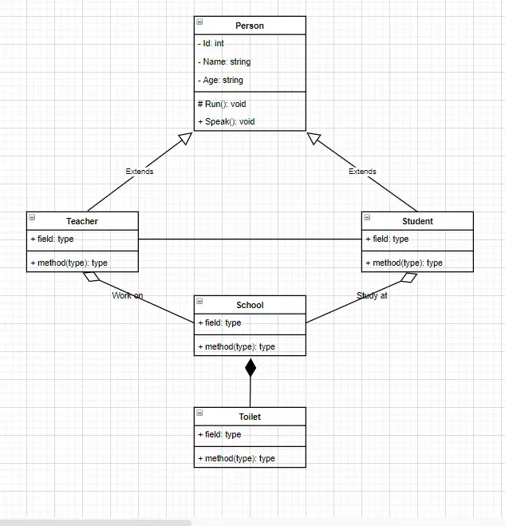
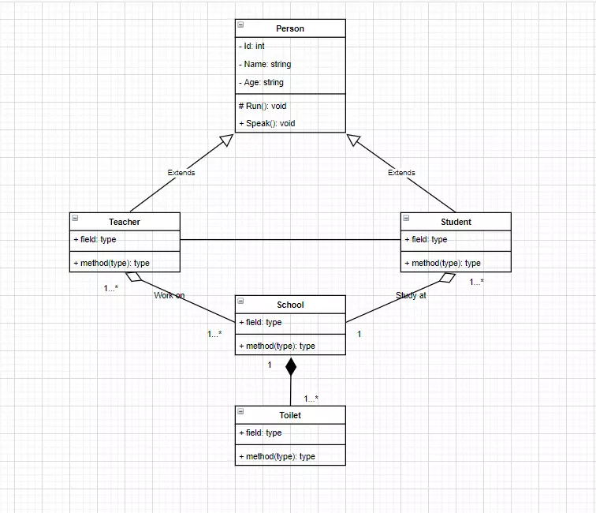

# Buổi 5: Dev thì không chỉ viết code

## I. Version control

### 1. Version control là gì?
- Là quá trình quản lý và theo dõi sự thay đổi của các file và dự án trong quá trìn phát triển. Nó giúp lưu trữ các lịch sử sửa đổi, cho phép nhóm làm việc cùng nhau trên các phiên bản của cùng một dự án và quản lý các thay đổi một cách hiệu quả.
- Version control system (`VCS`) là **hệ thống kiểm soát các phiên bản phân tán mã nguồn mở**. Các `VCS` sẽ lưu trữ tất cả các file trong toàn bộ dự án và ghi lại toàn bộ lịch sử thay đổi của file. Mỗi sự thay đổi được lưu lại sẽ được và thành một version (phiên bản).
- VCS nghĩa là hệ thống giúp lập trình viên có thể lưu trữ nhiều phiên bản khác nhau của một nguồn được nhân bản (**clone**) từ một kho chứa mã nguồn (**repository**), mỗi thay đổi vào nguồn trên **local** sẽ có thể ủy thác (**commit**) rồi đưa lên server nơi đặt kho chứa chính.
- Một máy tính khác nếu họ có quyền truy cập cũng có thể clone lại mã nguồn từ chương trình hoặc clone lại một tập hợp các thay đổi mới nhất trên máy tính kia.
- Lập trình viên có thể xem lại danh sách các sự thay đổi của file như xem một dòng thời gian của các phiên bản. Mỗi phiên bản bao gồm: nội dung file bị thay đổi, ngày giờ sửa đổi, người thay đổi, lý do thay đổi, tên phiên bản, ...

### 2. Tại sao cần sử dụng nó?

- VCS giúp lưu lại lịch sử các version của bất kỳ thay đổi nào của dự án. Giúp xem lại các sự thay đổi hoặc khôi phục (**revert**) sau này.
- Giúp cho nhiều người làm việc song song trên cùng một dự án mà không ghi đè lên công việc của nhau.
- Việc chia sẻ code trở nên dễ dàng hơn, có thể để public cho bất kỳ ai hoặc private chỉ cho một số người có thẩm quyền để truy cập và lấy code về.

## II. Các khái niệm về Git


### 1. Git là gì?
- Git là một hệ thống quản lý phiên bản phân tán phổ biến nhất hiện nay. **Git** cung cấp cho mỗi lập trình viên một kho lưu trữ (**repository**) riêng chứa toàn bộ lịch sử thay đổi.

### 2. Local repository
- **Local repository** (kho lưu trữ cục bộ) là kho lưu trữ (**repository**) của `Git` được lưu trữ trên máy tính của bạn. 

- Khi hoàn tất thực hiện các thay đổi đối với không gian làm việc (workspace) của mình, bạn có thể thêm chúng vào **staging area** và từ đó bạn có thể `commit` các thay đổi vào kho lưu trữ cục bộ (**local repository**) của mình. Điều này có thẻ được thực hiện ngay cả khi ngắt kết nối internet và không ai khác có thể thấy những thay đổi trong kho lưu trữ cục bộ (**local repository**) của bạn.

### 3. Remote repository

- Remote repository (**kho lưu trữ từ xa**) là kho lưu trữ (repository) của `Git` được lưu trữ trên một số máy tính từ xa (**remote computer**). 

- Remote repository thường được các nhóm sử dụng làm kho lưu trữ trung tâm (central repository) để mọi người đẩy (**push**) các thay đổi từ local repository của mình và từ đó người khác có thể kéo (**pull**) các thay đổi vào local repository của họ.

- Remote repository phổ biển nhất hiện nay là Github.

### 4. Branch
- Nhánh (**Branch**) đại diện cho các phiên bản (**version**) thay thế của dự án (**project**) chính hoặc thân cây (trunk). 

- Branch thường được dùng để thử nghiệm giúp phát triển các tính năng mới, cho phép bạn theo dõi các thay đổi thực nghiệm bạn thực hiện đối với kho lưu trữ và có thể hoàn nguyên về các phiên bản cũ hơn.

- Tác dụng `git branch`: liệt kê tất cả các branch.
- Cú pháp:
```
git branch
git branch -a
```

### 5. Commit
- Một commit đại diện cho một thời điểm cụ thể trong lịch sử của dự án của bạn. Sử dụng lệnh **git commit** kết hợp với lện **git add** để cho Git biết những thay đổi mà bạn muốn lưu vào local repo.
- `git commit`: commit nghĩa là một action để Git lưu lại một snapshot của các sự thay đổi trong thư mục làm việc. Và các tập tin, thư mục được thay đổi đã phải nằm trong Staging Area. Mỗi lần commit nó sẽ được lưu lại lịch sử chỉnh sửa của code kèm theo tên và địa chỉ email của người commit. Ngoài ra trong Git bạn cũng có thể khôi phục lại tập tin trong lịch sử commit của nó để chia cho một branch khác, vì vậy bạn sẽ dễ dàng khôi phục lại các thay đổi trước đó.
- Cú pháp:
```
git commit -m "your message"
```


### 6. Merge
- Lệnh **git merge** kết hợp với các yêu cầu (**pull requests**) để thêm các thay đổi từ nhánh này sang nhánh khác.
- Tác dụng `git merge`: merge 2 branch lại với nhau.
- Cú pháp:
```
git merge <:branch_muon_merge>
```
### 7. Pull 
- **Pull requests** thể hiện các đề xuất thay đổi cho nhánh chính. Nếu bạn làm việc với một nhóm, bạn có thể tạo các pull request để yêu cầu người bảo trì kho lưu trữ xem xét các thay đổi và hợp nhất chúng.
- Lệnh **git pull** đwuọc sử dụng để thêm các thay đổi vào nhánh chính.
- Tác dụng `git pull` : để thêm các thay đổi vào nhánh chính.
- Cú pháp:
```
git pull <:remote> <:branch>
```

### 8. Push
- Lệnh **git push** được sử dụng để cập nhật các nhánh từ xa với những thay đổi mới nhất mà bạn đã **commit**.
- Cú pháp:
```
git push <:remote> <:branch>
```

### 9. Clone
- Tác dụng `git clone`: copy một repo từ remote source.
- Cú pháp:
```
git clone <:clone git url>
```

### 10. Fork
- Một **fork** là một bản sao của một kho lưu trữ (repo). Các lập trình viên thường tận dụng lợi ích của fork để thử nghiệm các thay đổi mà không ảnh hưởng đến các dự án chính.

## II. Khi nào cần Pull Request? Cách tạo Pull Request.
- **Pull Request** (PR) là một yêu cầu được tạo ra bởi một nhóm phát triển hoặc lập trình viên để đề xuất thay đổi từ một nhánh chính (thường là `main` hoặc `master`) sang một nhánh khác của dự án trên `GitHub`. Thông qua PR, người tạo yêu cầu có thể trình bày sự thay đổi, giải thích tại sao thay đổi đó cần thiết và cung cấp thông tin chi tiết về quá trình triển khai.

- Pull Request không chỉ giúp tách biệt quá trình xây dựng và đánh giá mà còn thúc đẩy tính bảo mật và kiểm tra chất lượng. Những người khác có thể xem xét, thảo luận và đưa ra ý kiến phản hồi về thay đổi trước khi hợp nhất chúng vào nhánh chính của dự án.

**Cách tạo Pull Request**

***Bước 1: Fork dự án gốc***
- Truy cập vào dự án gốc trên GitHub.
- Nhấn vào nút `Fork` ở góc trên bên phải để sao chép dự án vào tài khoản của bạn.

***Bước 2: Clone dự án về máy***

- Truy cập vào `repository` đã `fork` trong tài khoản của bạn.
- Sao chép URL của repository.
- Mở `Terminal` và sử dụng lệnh `git clone` để clone dự án về máy.

***Bước 3: Tạo nhánh mới***
- Mở Terminal trong thư mục dự án đã clone.
- Sử dụng lệnh `git checkout -b [tên_nhánh]` để tạo và chuyển đổi sang một nhánh mới.

***Bước 4: Thực hiện thay đổi***

- Mở dự án trong trình chỉnh sửa mã nguồn.
- Thực hiện các thay đổi cần thiết và lưu lại.

***Bước 5: Commit và Push***
- Mở Terminal và sử dụng lệnh git add . để thêm các thay đổi vào danh sách `commit`.
- Sử dụng lệnh `git commit -m "Mô tả commit"` để commit các thay đổi đã thêm.
- Sử dụng lệnh `git push origin [tên_nhánh]` để đẩy thay đổi lên repository của bạn trên GitHub.

***Bước 6: Tạo Pull Request***
- Truy cập vào repository của bạn trên GitHub.
Nhấn vào nút “Compare & pull request” bên cạnh tên nhánh của bạn.
- Điền thông tin cần thiết, mô tả về `Pull Request` và nhấn `Create Pull Request`.

***Bước 7: Kiểm tra và xử lý yêu cầu chỉnh sửa***
- Nhóm quản lý dự án sẽ xem xét và thảo luận về `Pull Request` của bạn.
- Nếu cần chỉnh sửa, bạn chỉ cần thêm commit vào nhánh đã tạo và Pull Request sẽ tự động cập nhật.

***Bước 8: Pull Request được chấp nhận và merge***
- Sau khi Pull Request đạt yêu cầu, nhóm quản lý sẽ chấp nhận và `merge` vào nhánh chính.

- Code của bạn đã được hợp nhất vào dự án gốc.

## IV. UML (Unified Modeling Language - ngôn ngữ mô hình hóa thống nhất)

### 1. UML là gì?

UML là một ngôn ngữ mô hình gồm các ký hiệu đồ họa mà các phương pháp hướng đối tượng sử dụng để thiết kế các hệ thống thông tin một cách nhanh chóng.

### 2.Lí do cần vẽ UML:

- **Hiểu rõ Yêu Cầu:** UML giúp mô tả và hiểu rõ các yêu cầu của hệ thống từ góc độ người quản lý dự án và người sử dụng.

- **Thiết Kế Hệ Thống:** UML cung cấp các biểu đồ và ký hiệu để thiết kế cấu trúc và cách thức hoạt động của hệ thống.

- **Giao Tiếp Hiệu Quả**: UML tạo ra một ngôn ngữ chung để mô tả ý tưởng và thiết kế, giúp tăng cường giao tiếp giữa các thành viên trong nhóm phát triển và giữa nhóm phát triển và người quản lý.

- **Tạo Ra Tài Liệu Hệ Thống**: UML giúp tạo ra tài liệu dự án đồng thời và thực hiện, giúp dễ dàng theo dõi và duy trì hệ thống.

- **Kiểm Tra và Đánh Giá Thiết Kế**: Các biểu đồ UML, như biểu đồ lớp, biểu đồ tuần tự, và biểu đồ use case, có thể được sử dụng để kiểm tra và đánh giá thiết kế của hệ thống trước khi bắt đầu quá trình phát triển.

- **Quản Lý Các Yếu Tố Phức Tạp**: UML giúp quản lý sự phức tạp của hệ thống bằng cách tạo ra các mô hình trừu tượng để giảm bớt sự phức tạp và tăng tính rõ ràng.

- **Phân Chia Công Việc**: UML có thể được sử dụng để phân chia công việc giữa các thành viên trong nhóm phát triển và làm cho mỗi người hiểu rõ vai trò và trách nhiệm của mình.

## V. Mô hình Class Diagram, Acivity Diagram:

### 1. Class Diagram (sơ đồ lớp)
- là một loại biểu đồ trong kỹ thuật phần mềm, được sử dụng để mô tả cấu trúc và mối quan hệ giữa các lớp trong một hệ thông phần mềm. Nó một phần quan trọng của mô hình hóa thống nhất (UML).

**Các kiểu thành phần cơ bản của Class Diagram:**
- tên class
- thuộc tính
- phương thức



**Phạm vi truy cập trong class Diagram**
- private (-)
- public (+)
- protected (#)
- package/default


**Các mối quan hệ trong Class Diagram**

- `Inheritance`: 1 class kế thừa từ class khác.
- `Association`: 2 class có liên hệ với nhau nhưng không chỉ rõ mỗi liên hệ.
- `Composition`: đối tượng tạo ra từ class A mất thì đối tượng từ class B sẽ mất.
- `Agreegation`: đối tượng tạo từ class A mất thì đối tượng tạo từ class B vẫn tồn tại độc lập.





**Multiplicity trong class diagram**

- Sử dụng để thể hiện quan hệ về số lượng giữa các đối tượng được tạo từ các class trong class diagram.

0…1: 0 hoặc 1
n : Bắt buộc có n
0…* : 0 hoặc nhiều
1…* : 1 hoặc nhiều
m…n: có tối thiểu là m và tối đa là n



### 2. ACtivity Diagram:

- Biểu đồ hoạt động (Activity Diagram) là một dạng biểu đồ trong UML được sử dụng để mô hình hóa các hoạt động trong một hệ thống. Nó tập trung vào việc mô tả các hoạt động và luồng xử lý bên trong hệ thống.

**Các thành phần của Activity Diagram**

`start`: 
- khởi tạo một hoạt động
- một activity diagram có thể có nhiều trạng thái start
- kí hiệu:


`transition`:
- mô tả sự chuyển đổi trạng thái của các hoạt động
- kí hiệu: 


`Activity`:
- mô tả hành vi của đối tượng trong quy trình
- tên hoạt động phải ngắn gọn, đủ nghĩa. Nên đặt là động từ và mô tả đầy đủ ý nghĩa tổng thể của hoạt động nhất có thể.
- kí hiệu:


`Decision`:
- là kí hiệu biểu thị nút điều kiện chuyển hướng. Tùy theo trường hợp đúng hay sai của kết quả mà có hướng di chuyển tiếp theo tương ứng.
- bao gồm 2 loại branch và merge
- kí hiệu:


`Branch`:
- mô tả điều kiện rẽ nhánh
- chỉ một dòng điều khiển đi vào
- hai hoặc nhiều dòng điều khiển đi ra
- chỉ một dòng điều khiển dẫn đến kết quả
- một dòng chứa một điều kiện, điều kiện phải liên quan đến điều kiện và loại trừ nhau.
- kí hiệu:


`Merrge`:
- có 2 hoặc nhiều dòng điều khiển đi vào.
- chỉ một dòng điều khiển đi ra.
- kí hiệu:


`Synchronization bar`
- khi có các trường hợp cần hội tụ đủ nhiều luồng điều khiển một lúc để gộp thành một luồng xử lí thì cần dùng `JOIN`.
- khi cần phải tách một luòn điều khiển ra hai hoặc nhiều luồng khác biệt nhau thì cần dùng `FORK`. Mỗi luồng của `FORK` hoàn toàn không lệ thuộc nhau.
- kí hiệu:


`Join`
- Kết hợp các dòng điều khiển song song (fork)
- có hai hoặc nhiều dòng điều khiển vào
- chỉ có một dòng điều khiển ra, dòng điều khiển ra được tạo khi tất cả các dòng cần thiết đã vào.


`Fork`
- mô tả một dòng điều khiển được tách ra thực hiện song song.
- chỉ có một dòng điều khiển đi vào.
- có hai hoặc nhiều dòng điều khiển đi ra.
- dùng `fork` khi các hoạt động thực hiện không quan tâm thứ tự.
- kí hiệu:


`End`:
- mô tả trạng thái kết thúc quy trình
- một activity diagram có thể có một hoặc nhiều trạng thái kết thúc.
- kí hiệu:


