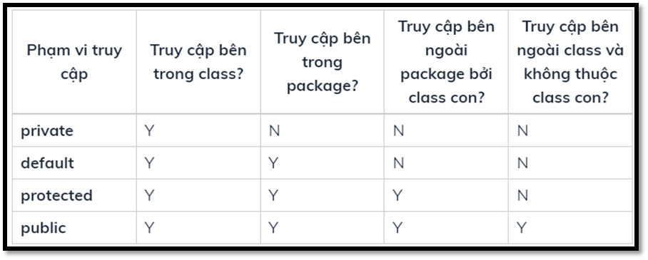

# [Buổi 4] Mọi thứ đều là đối tượng
Nội dung:
Trả lời câu hỏi về bài tập buổi trước
Tính đóng gói trong Java
Tính kế thừa trong Java
Tính đa hình trong Java
Một số bài tập luyện tập

## 1. Tính đóng gói (Encapsulation) trong Java

### 1.1 Tính đóng gói là gì ?
Tính đóng gói là kỹ thuật ẩn giấu thông tin không liên quan và hiện thị ra thông liên quan. Mục đích chính của đóng gói trong java là giảm thiểu mức độ phức tạp phát triển phần mềm.

Tính đóng gói trong Java là một tiến trình đóng gói code và dữ liệu lại với nhau vào trong một đơn vị unit đơn. Chúng ta có thể tạo một lớp được bao đóng hoàn toàn trong Java bằng việc tạo tất cả thành viên dữ liệu của lớp là `private`. Ta sử dụng phương thức `setter` và `getter` để thiết lập và lấy dữ liệu trong nó.

Để đạt được đóng gói trong Java ta cần:
- Khai báo các biến của một lớp là `private`.
- Cung cấp phương thức `setter` và `getter` là `public` để có thể sửa đổi và xem các giá trị biến.

`Ví dụ:`

```java
public class Student {
    private String name;
 
    public String getName() {
        return name;
    }
    //setter
    public void setName(String name) {
        this.name = name;
    }
    //getter
    public String getName(){
        return name;
    }

    public static void main(String[] args) {
        Student st = new Student;
        st.setName("Tung");
        System.out.println(st.getName());
    }
}
```

```
Output:
Tung
```

Quy ước đặt tên phương thức getter và setter như sau:
- `Getter`: bắt đầu bằng chữ get + viết hoa chữ đầu tiên tất cả các từ (viết hoa chữ đầu tiên của tên biến).
- `Setter`: bắt đầu bằng chữ set + viết hoa chữ đầu tiên tất cả các từ (viết hoa chữ đầu tiên của tên biến).

### 1.2 Lợi ích của đóng gói trong java

- Hạn chế được các truy xuất không hợp lệ tới các thuộc tính của đối tượng.
- Giúp cho trạng thái của các đối tượng luôn đúng.
- Giúp ẩn đi những thông tin không cần thiết về đối tượng.
- Cho phép bạn thay đổi cấu trúc bên trong lớp mà không ảnh hưởng tới các lớp khác.

## 2. Tính kê thừa (Inheritance) trong Java

### 2.1 Tính kế thừa là gì ?
- Lớp được thừa hưởng những thuộc tính và phương thức từ lớp khác được gọi là dẫn xuất (`Derived Class`) hay lớp con (`Subclass`) và lớp bị lớp khác kế thừa gọi là lớp cơ sở (`Base Class`) hay lớp cha (`Superclass`).
- Khi kế thừa class con được hưởng tất cả các phương thức và thuộc tính của class cha.Tuy nhiên, nó chỉ được truy cập các thành viên `public` và `protected` của class cha. Nó không được phép truy cập đến thành viên `private` của class cha.
- Trong Java, để kế thừa lớp ta dùng từ khóa `extends`:

```java
class Subclass-name extends Superclass-name {  
   //methods and fields
}  
```

### 2.2 Các kiểu kế thừa trong java

- Có 3 kiểu kế thừa trong java đó là: đơn kế thừa, kế thừa nhiều cấp, kế thừa thứ bậc.


**Ví dụ về đơn kế thừa:**
```java
class Animal {
    void eat() {
        System.out.println("eating...");
    }
}
 
class Dog extends Animal {
    void bark() {
        System.out.println("barking...");
    }
}
 
public class TestInheritance1 {
    public static void main(String args[]) {
        Dog d = new Dog();
        d.bark();
        d.eat();
    }
}
```

```
Output:
barking...
eating...
```

**Ví dụ về kế thừa nhiều cấp**

```java
class Animal {
    void eat() {
        System.out.println("eating...");
    }
}
 
class Dog extends Animal {
    void bark() {
        System.out.println("barking...");
    }
}
 
class BabyDog extends Dog {
    void weep() {
        System.out.println("weeping...");
    }
}
 
public class TestInheritance2 {
    public static void main(String args[]) {
        BabyDog d = new BabyDog();
        d.weep();
        d.bark();
        d.eat();
    }
}
```
```
Output:
weeping...
barking...
eating...
```
**Ví dụ về kế thừa thứ bậc**

```java
class Animal {
    void eat() {
        System.out.println("eating...");
    }
}
 
class Dog extends Animal {
    void bark() {
        System.out.println("barking...");
    }
}
 
class Cat extends Animal {
    void meow() {
        System.out.println("meowing...");
    }
}
 
public class TestInheritance3 {
    public static void main(String args[]) {
        Cat c = new Cat();
        c.meow();
        c.eat();
        // c.bark(); // compile error
    }
}
```

```
Output:
meowing...
eating...
```

**Tại sao đa kế thừa không được support trong java?**
- Để giảm thiểu sự phức tạp và đơn giản hóa ngôn ngữ, đa kế thừa không được support trong java. Hơn nữa, trong thực tế ít khi ta gặp trường hợp phải kế thừa trực tiếp từ 2 lớp trở lên.

Ví dụ: Có 3 lớp A, B, C. Trong đó lớp C kế thừa từ các lớp A và B. Nếu các lớp A và B có phương thức giống nhau và bạn gọi nó từ đối tượng của lớp con, như vậy khó có thể xác đinh được việc gọi phương thức của lớp A hay B.

Vì vậy lỗi khi biên dịch sẽ tốt hơn lỗi khi runtime, java sẽ print ra lỗi "compile time error" nếu bạn cố tình kế thừa 2 class.

```java
class A {
    void msg() {
        System.out.println("Hello");
    }
}
 
class B {
    void msg() {
        System.out.println("Welcome");
    }
}
 
public class C extends A,B { 
 public static void main(String args[]) {
        C obj = new C();
        obj.msg();
    }
}
```

```
Output:
Compile Time Error
```

**Phạm vi truy cập trong kế thừa:**
- Để ghi đè phương thức của lớp cha thì lớp con phải có phạm vi truy cập >= phạm vi truy cập của phương thức lớp cha.



Từ bảng ta có thể thấy phạm vi truy cập được sắp xếp theo thứ tự tăng dần: 

`private -> default -> protected -> public`

**Kế thừa phương thức khởi tạo:**
- Lớp con không được kế thừa thuộc tính và phương thức `private` từ lớp cha: Trong kế thừa, các lớp con chỉ có thể thừa hưởng được các thuộc tính và phương thức có phạm vi truy cập `public`, `protected` và `default` (trong trường hợp lớp con và lớp cha cùng `package`). Do đó, muốn truy cập đến những thuộc tính của lớp cha thì bạn phải thông  qua các `setter` và `getter` của lớp cha.

- Constructor của lớp con luôn gọi tới constructor của lớp cha: nếu không chỉ rõ gọi tới constructor nào thì lớp con sẽ luôn gọi tới constructor mặc định, nếu bạn đã khai báo constructor có tham số khác thì sẽ không tồn tại constructor mặc định và chương trình sẽ báo lỗi, để sửa lại thì bạn cần dùng từ khóa `super` để chỉ cho lớp con biết cần gọi tới constructor nào.

```java
class Person {
    private String name;

    public Person(String name) {
        this.name = name;
    }

    public String getName() {
        return name;
    }

    public void setName(String name) {
        this.name = name;
    }
}

class Student extends Person {
    public Student(String name) {
        super(name);
    }
}

public class Entry {
    public static void main(String[] args) {
        Student s1 = new Student("Trung");
        System.out.println(s1.getName());
    }
}
```

```
Ouput:
Trung
```

Trong ví dụ trên, `super(name)` chính là gọi tới constructor một tham số của lớp cha.

### 2.3 Ghi đè phương thức
Ghi đè phương thức trong java xảy ra nếu lớp con có phương thức giống lớp cha.

Nói cách khác, nếu lớp con cung cấp sự cài đặt cụ thể cho phương thức đã được cung cấp bởi một lớp cha của nó được gọi là ghi đè phương thức (method overriding) trong java.

**Sử dụng ghi đè phương thức trong java**
- Ghi đè phương thức được sử dụng để cung cấp cài đặt đặc biệt của một phương thức mà đã được định nghĩa ở lớp cha.
- Ghi đè phương thức được sử dụng cho đa hình runtime.

**Các nguyên tắc ghi đè phương thức trong java**
- Phương thức phải có tên giống với lớp cha.
- Phương thức phải có tham số giống với lớp cha.
- Lớp con và lớp cha có mối quan hệ kế thừa.

```java
class SuperClass{
    public void display() {
        System.out.println("Hello from SuperClass");
    }
}

class SubClass extends SuperClass{
    @Override
    public void display() {
        System.out.println("Hello from SubClass");
    }
}

class Entry {
    public static void main(String[] args) {
        SubClass s = new SubClass();
        s.display();
    }
}
```

```
Output:
Hello from SubClas
```

Trong ví dụ, phương thức `display()` của `Superclass` bị ghi đè bởi `Subclass`. `@Override` là một `annotation` để chú thích rằng display() là một phương thức ghi đè từ lớp cha.

Việc sử dụng @Override annotation là không bắt buộc nhưng trong vài trường hợp bạn nên dùng vì các lợi ích sau:

- chương trình sẽ không kiểm tra xem phương thức này có thực sự ghi đè phương thức của lớp cha hay không, nếu không thì sẽ báo lỗi. Việc này giúp ngăn chặn lỗi đánh máy như ghi nhầm tên hay lỗi chính tả (nếu không có @Override sẽ không thể biết bạn có thực sự ghi đè phương thức hay không).

- giúp người đọc code của bạn sẽ hiểu được đây là phương thức ghi đè.

**Lưu ý:**
- Trong trường hợp phương thức lớp cha bị ghi đè, ta vẫn có thể gọi tới nó bằng từ khóa `super`.
- Phương thức `static` sẽ không thể bị ghi đè.
- Các phương thức `non-static` có thể ngăn việc ghi đè bằng các thêm từ khóa `final`.

**Ví dụ ghi đè phương thức Lớp Object:**

- Khi chưa ghi đè

```java
class Student{
}
public class Entry {
    public static void main(String[] args) {
        Student s = new Student();
        System.out.println(s.hashCode());
        System.out.println(s.toString());
        System.out.println(s.getClass());       
    }
}
```

```
Output:
1554547125
OOP.Student@5ca881b5
class OOP.Student
```

- Sau khi ghi đè phương thức: 
```java
public class Student {
    private String name;
    private String address;
    private double gpa;
    public Student(String name, String address, double gpa) {
        this.name = name;
        this.address = address;
        this.gpa = gpa;
    }
    @Override
    public String toString() {
        return "Name: " + name + ", address: " + address + ", GPA: " + gpa;
    }
}
```

```
Output:
Name: Kien, age: 23
```

**Up-casting và Down-casting trong Java:**
- `Up-casting`: khi biến của lớp cha tham chiếu tới đối tượng của lớp con (đối tượng của lớp con bị chuyển kiểu dữ liệu về lớp cha).

```java
class Animal {
    public void sound() {
        System.out.println("some sound");
    }
}

class Cat extends Animal {
    public void sound() {
        System.out.println("meow meow");
    }
}

class Dog extends Animal {
    public void sound() {
        System.out.println("woof woof");
    }
}

public class Entry {
    public static void main(String[] args) {
        // Up-casting
        Animal animal1 = new Cat();
        animal1.sound();
        // Up-casting
        Animal animal2 = new Dog();
        animal2.sound();
    }
}
```

```
Output:
meow meow
woof woof
```

Lớp Cat và Dog đã được gán cho biến thuộc lớp Animal (chuyển kiểu dữ liệu về lớp Animal).

**Lưu ý:** Khi biến của lớp cha tham chiếu tới đối tượng của lớp con thì biến này chỉ có thể gọi tời các thuộc tính và phương thức có ở lớp cha và nếu lớp con ghi đè thì phương thức sẽ được gọi ở lớp con.

- `Down-casting`: ngược với up-casting, nghĩa là chuyển từ lớp cha sang lớp con.

```java
class Animal {
    public void sound() {
        System.out.println("some sound");
    }
}

class Dog extends Animal {
    public void sound() {
        System.out.println("woof woof");
    }
    public void play() {
        System.out.println("The dog is playing");
    }
}

public class Entry {
    public static void main(String[] args) {
        Animal animal = new Dog();
        // Down-casting
        ((Dog)animal).play();
    }
}
```

```
Output:
The dog is playing
```

## 4. Tính đa hình (Polymorphism) trong Java

### 4.1 Tính đa hình là gì ?
- Polymorphism là từ được cấu thành từ 2 từ Hy Lạp là poly và morhps, nếu hiểu theo nghĩa tiếng anh thì từ này có nghĩa là **one thing in many form**.
- Tính đa hình được thể hiện trong code dưới 3 hình thức: nạp chồng phương thức, ghi đè phương thức và đa hình thông qua các đối tượng đa hình (`polymorphic objects`).

### 4.2 Đa hình với nạp chồng phương thức:

```java
class Calculator {
	public int add(int a, int b) {
		return a + b;
	}

	public double add(double a, double b) {
		return a + b;
	}

	public int add(int a, int b, int c) {
		return a + b + c;
	}
}

public class Entry {
	public static void main(String[] args) {
		Calculator calculator = new Calculator();
		System.out.println(calculator.add(1, 2));
		System.out.println(calculator.add(3.3, 4.2));
		System.out.println(calculator.add(1, 2, 3));
	}
}
```

```
Output:
3
7.5
6
```

### 4.3 Đa hình với ghi đè phương thức:

```java
class Employee {
	private String name;
	private int salary;

	public Employee(String name, int salary) {
		super();
		this.name = name;
		this.salary = salary;
	}

	public String getName() {
		return name;
	}

	public void setName(String name) {
		this.name = name;
	}

	public int getSalary() {
		return salary;
	}

	public void setSalary(int salary) {
		this.salary = salary;
	}

	public void display() {
		System.out.println("Name: " + getName());
		System.out.println("Salary: " + getSalary());
	}
}

class Manager extends Employee {
	private int bonus;

	public Manager(String name, int salary, int bonus) {
		super(name, salary);
		this.bonus = bonus;
	}

	public int getBonus() {
		return bonus;
	}

	public void setBonus(int bonus) {
		this.bonus = bonus;
	}

	@Override
	public int getSalary() {
		return super.getSalary() + bonus;
	}
}
```

Ta thấy lớp Manager đã kế thừa phương thức getSalary() và ghi đè cách tính lương khác so với Employee.

### 4.4 Đa hình thông qua các đối tượng đa hình (polymorphic objects)

```java
class Animal {
    public void sound() {
        System.out.println("some sound");
    }
}
 
class Dog extends Animal {
    public void sound() {
        System.out.println("bow wow");
    }
}
 
class Cat extends Animal {
    public void sound() {
        System.out.println("meow meow");
    }
}
 
class Duck extends Animal {
    public void sound() {
        System.out.println("quack quack");
    }
}

public class Entry {
	public static void main(String[] args) {
		Animal animal = new Animal();
		animal.sound();
		animal = new Dog();
		animal.sound();
		animal = new Duck();
		animal.sound();
		animal = new Cat();
		animal.sound();
	}
}
```

```
Ouput:
some sound
bow wow
quack quack
meow meow​
```


