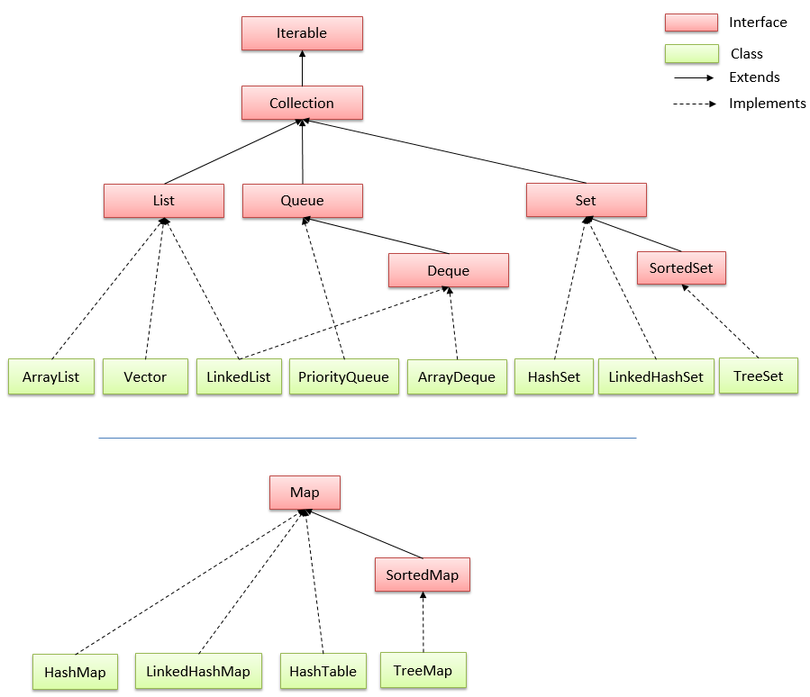

# BUỔI 8 - MỘT SỐ CẤU TRÚC DỮ LIỆU THƯỜNG THẤY TRONG JAVA

### 1. Cấu trúc dữ liệu là gì, sử dụng khi nào?

Cấu trúc dữ liệu là phương pháp biểu diễn các đối tượng ở thế giới thực thành một số đối tượng dữ liệu được tổ chức và lưu trữ trong máy tính để có thể dễ dàng truy cập và xử lý nó từ đó đạt hiệu quả tốt nhất trong quá tình xử lý thông tin.

Cấu trúc dữ liệu thường đi kèm với các phép toán và thuật toán cụ thể để thực hiện các thao tác trên dữ liệu đó. 

Cấu trúc dữ liệu cần được sử dụng khi cần tổ chức và quản lý dữ liệu mọt cách có hiệu suất và linh hoạt, ví dụ:
- Tìm kiếm và truy cập dữ liệu: khi ta cần thực hiện các thao tác tìm kiếm, truy cập hoặc cập nhật dữ liệu một cách hiệu quả.
- Sắp xếp dữ liệu: Khi ta cần sắp xếp dữ liệu theo một tiêu chí nào đó để dễ dàng thực hiện tính toán hoặc sử dụng với mục đích nào đó.
- Thực hiện các thao tác đặc biệt: khi ta cần thực hiện các thao tác cụ thể như đồng bộ hóa, quản lý ngăn xếp, hàng đợi, ... hoặc quản lý dữ liệu theo các quy luật của cấu trúc dữ liệu.
- Đối phó với các dữ liệu phức tạp: ví dụ mối quan hệ giữa các đối tượng thì sư dụng cấu trúc dữ liệu đồ thị là tối ưu hơn.

### 2. Interface Iterable, Collection

#### 2.1 Interface Iterable
Là một interface trong java được triển khai bởi các lớp có thể lặp lại (iterable). Nó định nghĩa một phương thức duy nhất là `iterator`, trả về đối tượng  `Iterator`. Đối tượng này được sử dụng đeer lặp qua các phần tử của tập hợp.
**Interaface Iterator**
Cung cấp phương tiện để lặp đi lặp lại các thành phần từ đầu đến cuối của một Collection.
Các phương thức phổ biến của Interface Iterator:
|Phương thức|Mô tả|
|:-|:-|
|public boolean hasNext()|trả về true nếu còn phần tử kế tiếp phần tử đang duyệ|
|public object next()|trả về phần tử hiện tại và di chuyển con trỏ tới phần tử kế tiếp|
|public void remove()|loại bỏ phần tử cuối được trả về bởi iterator, ít khi được sử dụng|
#### 2.2 Interface Collection
Phân biệt Collection và Collections:
- Collections trong java là một khuôn khổ cung cấp một kiến trúc để lưu trữ và thao tác tới nhóm các đối tượng. Tất cả các hoạt động mà bạn thực hiện trên một dữ liệu như tìm kiếm, phân loại, chèn, xóa, ... có thể thực hiện bởi Java Collections.
- Collection trong java là một root interface trong hệ thống cấp bậc Collection. Java Collection cung cấp nhiều interface (Set, List, Queue, Deque, ...) và các lớp (ArrayList, Vector, LinkedList, PriorityQueue, HashSet, LinkedHashSet, TreeSet, ...) 

**Hệ thống cấp bậc Collection trong Java**


**Các phương thức của Interface Collection trong Java**

|Phương thức|Mô tả|
|:-|:-|
|public boolean add(Object element)|chèn một phần tử vào Collection|
|public boolean addAll(Collection)|chèn các phần tử collection được chỉ định vào collection gọi phương thức này|
|public boolean remove(Object element)|xóa phần tử được chỉ định trong collection|
|public boolean removeAll(Collection c)|xóa tất cả các phần tử của Collection c có trong Collection gọi phương thức này|
|public boolean retainAll(Collection c)|xóa tất cả các phần tử có trong Collection gọi phương thức này trừ các phần tử có trong Collection c|
|public int size()|trả lại tổng số các phần tử trong collection|
|public void clear()|loại bỏ tất các các phần tử có trong Collection|
|public boolean contains(Object element)|tìm kiếm phần tử trong Collection|
|public boolean containsAll(Collection c)|tìm kiếm Collection c trong Collection gọi tới phương thức này|
|public Iterator iterator()|trả về iterator đầu Collection|
|public Object[] toArray()|chuyển đổi Collection thành Array|
|public boolean isEmpty()|trả về true nếu Collection trống|
|public boolean equals(Object element)|so sánh 2 Collection|
|public int hashCode()|trả về số hashcode của Collection|

### 2.3 Interface List
Là một interface trong java chức các phương thức để chèn và xóa các phần tử dựa trên chỉ số index.
List kế thừa Interface Collection và triển khai bởi các lớp ArratList, Vector, LinkedList.


**Các phương thức của Interface List trong Java**

|Phương thức|Mô tả|
|:-|:-|
|void add(int index, Object element)|chèn các phần tử vào list tại vị trí index|
|boolean addAll(int index, Collection c)|chèn tất cả các phần tử của Collection c vào List tại chỉ số index|
|object get(int index)|trả về đối tượng được lưu trữ tại chỉ số index|
|object set(int index, Object element)|gán lại đối tượng cho phần tử tại vị trí index|
|object remove(int index)|xóa phần tử tại vị trí index|
|ListIterator listIterator()|trả về một iterator bắt đầu từ phần tử đầu tiên của list|
|ListIterator listIterator(int index)|trả về iterator mà phần tử bắt đầu từ chỉ số index chỉ định|

**ListIterator trong Java**
Là một interface để duyệt các phần tử của List trong Java.

Các phương thức của ListIterator trong Java
|Phương thức|Mô tả|
|:-|:-|
|boolean hasNext()|trả về true nếu List Iterator tồn tại phần tử kế tiếp phần tử hiện tại|
|Object next()|trả về phần tử kế tiếp trong danh sách và di chuyển con trỏ tới vị trí phần tử tiếp theo|
|boolean hasPrevious()|trả về true nếu List Iterator có tồn tại phần tử trước phần tử hiện tại|
|Object previous()|trả về phần tử phía trước danh sách và di chuyển con trỏ tới vị trí phần tử trước|


#### 2.4 Interface Set trong Java
Là một interface kế thừa Interface Collection trong Java. Set không thể chứa các phần tử trùng lặp.


Set được triển khai bới HashSet, LinkedHashSet, TreeSet hoặc EnumSet:
- HashSet: lưu trữ các phần tử trong mảng băm, là cách thực hiện tốt nhất, tuy nhiên nó không đảm bảo về thứ tự các phần tử được chèn vào.
- TreeSet: lưu trữ các phần tử của nó trong một cây, sắp xếp các phần tử của nó dựa trên các giá trị của chúng, tuy nhiên sẽ chậm hơn HashSet.
- LinkedHashSet: triển khai dưới dạng bảng băm, có cấu trúc dữ liệu danh sách liên kết, sắp xếp các phần tử của nó dựa trên thứ tự chúng được chèn vào tập hợp.
- EnumSet là một cài đặt chuyên biệt để sử dụng với các kiểu enum.

**Các phương thức của Interface Set trong Java**

|Phương thức|Mô tả|
|:-|:-|
|boolean add(Object element)|chèn phần tử vào Set|
|boolean addAll(Collection c)|chèn tất cả các phần tử của c vào Set|
|void clear()|xóa tất cả các phần tử khỏi Set|
|boolean contains(Object element)|trả về true nếu trong Set chứa đối tượng cần tìm|
|boolean containsAll(Collection c)|trả về true nếu set chứa tất cả các phần tử của Collection c|
|boolean equals(Object o)|so sánh với đối tượng được chỉ định với Set|
|boolean isEmpty()|trả về true nếu Set không chứa phần tử nào|
|int hashCode()|trả về giá trị mã băm|
|Iterator iterator()|trả về một trình vòng lặp iterator để duyệt qua tất cả các phần tử của Set|
|boolean remove(Object o)|xóa tất cả các phần tử chỉ định ra khỏi Set|
|boolean removeAll(Collection c)|xóa tất cả các phần tử của Collection c có trong Set|
|boolean retainAll(Collection c)|xóa tất cả các phần tử của Set trừ các phần tử có trong Colletion c|
|int size()|trả về số lượng phần tử có trong Set|
|Object[] toArray()|trả về Array chứa tất cả các phần tử có trong Set|
|T[] toArray(T[] a)|trả về một mảng chứa tất cả các phần tử trong Set, kiểu run-time của mảng trả về là kiểu đã định|

**Lớp HashSet trong Java**


Là một lớp kế thừalowps AbstractSet và triển khai của Set Interface trong Collectiosn Frameworks nên nó có một vài đặc điểm và phương thức tương đồng với Set. HashSet được sử dụng để tạo một Collection sử dụng bảng băm (hash table) để lưu trữ.
Một **hash table** lưu trữ thông tin bởi sử dụng kĩ thuật đặc biệt gọi là **hashing** (băm). Trong hashing, nội dung mang tính thông tin của một **key** được sử dụng để quyết định một **value** duy nhất được gọi là **hash code** của nó. 
**Hash code** sau đó được sử dụng như là **index**, tại đó dữ liệu mà liên kết với key được lưu giữ. Phép biến đổi của key vào trong hash code của nó được thực hiện tự động.

**Các phương thức của lớp HashSet**
Tương tự với các phương thức của Set Interface.

```java
import java.util.*;

public class TestHashSet {
    private static String hor = "=".repeat(50);
    public static void main(String[] args) {
        Set<String> hashSet = new HashSet<String>();
        hashSet.add("one");
        hashSet.add("two");
        hashSet.add("three");
        hashSet.add("four");
        hashSet.add("five");
        hashSet.add("six");
        System.out.println("Các phần tử của hashet là: ");
        System.out.println(hashSet);
        enter();

        System.out.println("Test phương thức removeAll:");
        Set<String> hashSet2 = new HashSet<String>();
        hashSet2.add("three");
        hashSet2.add("five");
        hashSet2.add("ten");
        hashSet2.removeAll(hashSet);
        System.out.println(hashSet2);
        enter();

        System.out.println("Test phương thức retainAll:");
        Set<String> hashSet3 = new HashSet<String>();
        hashSet3.add("three");
        hashSet3.add("five");
        hashSet3.add("ten");
        hashSet3.retainAll(hashSet);
        System.out.println(hashSet3);
        enter();

        System.out.println("Test phương thức addAll:");
        Set<String> hashSet4 = new HashSet<String>();
        hashSet4.addAll(hashSet);
        for(String element : hashSet4) {
            System.out.println(element);
        }
        enter();

        System.out.println("Test phương thức toArray:");
        Set<String> hashSet5 = new HashSet<String>();
        hashSet5.addAll(hashSet);
        // khi để là [0] thì java sẽ tạo mảng mới có kích thước phù hợp với kích thước của Set
        String[] a = hashSet5.toArray(new String[0]);
        for(String element:a) System.out.println(element);
        enter();
    }
    public static void enter() {
        System.out.println(hor);
    }
}
```
[HashSet hoạt động như thế nào ?](https://viettuts.vn/java-collection/hashset-trong-java-hoat-dong-nhu-the-nao)

**LinkedHashSet trong Java**
Là một bản cài đặt bảng băm và danh sách liên kết của Set. Nó extends Class AbstractSet và implements Interface Set.
Những điểm quan trọng về lớp LinkedHashSet trong Java:
- Chỉ chứa các phần tử duy ngất như HashSet.
- Cho phép chứa các phần tử null.
- Duy trì thứ tự chèn.

```java
import java.util.*;

public class LinkedHashSet {
    public static void main(String[] args) {
        Set<String> linkedHashSet = new java.util.LinkedHashSet<String>();
        linkedHashSet.add("one");
        linkedHashSet.add("two");
        linkedHashSet.add("three");
        linkedHashSet.add("four");
        linkedHashSet.add("five");
        linkedHashSet.add("six");
        System.out.println("Các phần tử của LinkedHashSet là: ");
        System.out.println(linkedHashSet);
    }
}
```
```
Output:
Các phần tử của LinkedHashSet là: 
[one, two, three, four, five, six]
```
**Các phương thức của LinkedHashSet**
Không có gì khác biệt so với HashSet

**Lớp TreeSet trong Java**
Lớp TreeSet trong Java implements Set Interface, NavigableSet sử dụng cấu trúc cây để lưu trữ phần tử, extends class AbstractSet. Các đối tượng của lớp TreeSet được duy trì theo thức tự tăng dần.

Các đặc điểm quan trọng về Class TreeSet trong Java:
- Chỉ chứa các phần tử duy nhất giônsg như HashSet.
- Thời gian truy xuất nhanh.
- Duy trì thứ tự tăng dần.

```java
import java.util.TreeSet;

public class TestTreeSet {
    public static void main(String[] args) {
        TreeSet<String> treeSet = new TreeSet<String>();
        treeSet.add("three");
        treeSet.add("one");
        treeSet.add("five");
        treeSet.add("two");
        treeSet.add("four");
        System.out.println("Các phần tử trong treeSet là:");
        System.out.println(treeSet);
        System.out.println(treeSet.getFirst());
        System.out.println(treeSet.getLast());
    }
}
```
```
Output:
Các phần tử trong treeSet là:
[five, four, one, three, two]
five
two
```

#### 2.5 Interface Queue trong Java
\- Interface Queue nằm trong package java.util và kế thừa Collection interface. Nó được sử dụng để lưu trữ các phần tử được xử lý theo thứ tự **FIFO** (First In First Out).
\- Tương tự **List**, **Queue** là một interface do đó không thể tạo đối tượng từ queue mà phải thông qua các class implements nó như **LinkedList**, **ArrayDeque**, **PriorityQueue**.

Một số phương thức thường được sử dụng của Queue interface là:

|Phương thức|Mô tả|
|:-|:-|
|add()|Chèn phần tử đã chỉ định vào hàng đợi. Nếu tác vụ thành công, trả về true, nếu không nó sẽ ném ra một ngoại lệ.|
|offer()|Chèn phần tử đã chỉ định vào hàng đợi. Nếu tác vụ thành công, |offer() trả về true, nếu không nó sẽ trả về false.|
|element()|Trả về phần đầu của hàng đợi. Ném một ngoại lệ nếu hàng đợi trống.|
|peek()|Trả về đầu của hàng đợi. Trả về null nếu hàng đợi trống.|
|remove()|Trả về và xóa phần đầu của hàng đợi. Ném một ngoại lệ nếu hàng đợi trống.|
|poll()|Trả về và loại bỏ phần đầu của hàng đợi. Trả về null nếu hàng đợi trống.|
#### 2.6 Interfacce Map trong Java

**Các phương thức của Map trong Interface**

|Phương thức|Mô tả|
|:-|:-|
|Object put(Object key, Object value)|chèn một mục nhập trong map hiện tại|
|void putAll(Map map)|chèn map chỉ định vào map gọi hàm|
|Object remove(Object key)|xóa mục nhập của key chỉ định|
|Object get(Object key)|trả lại giá trị khóa được chỉ định|
|boolean containsKey(Object key)|tìm kiếm key được chỉ địnhtừ map gọi phương thức|
|Set keySet()|trả lại Collection Set có chứa tất các key|
|Set entrySet()|trả lại đối tượng Set chứa tất cả các key và value|

**Map.Entry Interface**

Là một interface con của Map. NÓ cung cấp các phương pháp để truy xuất key và value.

|Phương thức|Mô tả|
|:-|:-|
|Object getKey()|dùng để lấy key|
|Object getValue()|dùng để lấy value|

**HashMap trong Java**
Là một lớp kế thừa lớp AbstractMap và triển khai của Map Interface trong Collections Framework nên nó có một vài điểm tương đồng với Map.
Những đặc điểm quan trọng về lớp HashMap:
- Lưu trữ dữ liệu dướng dạng cặp key và value
- Chứa các key duy nhất 
- Có thể có 1 key là null và nhiều giá trị null
- Duy trì các phần tử không theo thứ tự


**Constructor của lớp HashMap trong Java**
|Constructor|Mô tả|
|:-|:-|
|HashMap()|khởi tạo một HashMap trống|
|HashMap (int capacity, float loadFactor)|tạo một HashMap trống với capacity (dung lượng) ban đầu được chỉ định và hệ số tải (loadFactor) được chỉ định|
|HashMap(int capacity)|được sử dụng để xây dựng một HashMap trống với dung lượng ban đầu được chỉ định và hệ số tải mặc định là 0.75|
|HashMap(Map mp)|xây dựng một HashMap từ các phần tử của Map cho trước|

**Phương thức của lớp HashMap trong Java**

|Phương thức|Mô tả|
|:-|:-|
|void clear()|xóa tất cả các phần tử của HashMap|
|Object clone()|trả về một bản copy của HashMap|
|boolean containsKey(Object key)|trả về true nếu HashMap chưa một phần tử có key được chỉ định|
|boolean containsValue(Object value)|trả về true nếu HashMap chứa một phần tử có value được chỉ định|
|Set entrySet()|trả về Set có phần tử là tất cả các key của HashMap|
|Object get(Object key)|trả về giá trị của key được chỉ định|
|boolean isEmpty()|trả về true nếu HashMap trống|
|set keySet()|trả về một Set Interface chưa tất cả các key của HashMap|
|Object put(Object key, Object value)|thêm một cặp key-value vào HashMap|
|void putAll(Map mp)|sao chếp các phần tử của Map được chỉ định vào HashMap|
|Object remove(Object key)|xóa một phần tử có key chỉ định ra khỏi HashMap|
|int size()|trả về số phần tử của HashMap|
|Collection values()|trả về Collection của các giá trị có trong HashMap|

```java
import java.util.*;

public class TestHashMap {
    private static String hor = "=".repeat(50);
    public static void main(String[] args) {
        Map<String, Integer> mp = new HashMap<String, Integer>();
        mp.put("three", 3);
        mp.put("four", 4);
        mp.put("five", 5);
        mp.put("one", 1);
        mp.put("two", 2);
        mp.put("six", 6);
        System.out.println(mp);
        enter();

         //Ví dụ phương thức entrySet + putAlls:

        System.out.println("Ví dụ phương thức entrySet + putAlls:");
        Map<String, Integer> mp2 = new HashMap<String, Integer>();
        mp2.putAll(mp); // thêm các phần tử của mp vào mp2
        Set<Map.Entry<String, Integer>> entry = mp2.entrySet();
        Iterator<Map.Entry<String, Integer>> iterator = entry.iterator();
        while(iterator.hasNext()) {
            Map.Entry<String, Integer> tmp = iterator.next();
            System.out.println(tmp.getKey() + " " + tmp.getValue());
        }
        enter();
        


         // Ví dụ về phương thức values
        System.out.println("Ví dụ về phuong thức values của HashMap:");
        Collection<Integer> values = mp.values(); // trả về Collection chứa tất cả các value của HashMap
        Iterator<Integer> iterator1 = values.iterator();
        while(iterator1.hasNext()) {
            System.out.println(iterator1.next());
        }
        enter();
      

    }
    public static void enter() {
        System.out.println(hor);
    }
}

```

[HashMap trong Java hoạt động như thế nào ?](https://viettuts.vn/java-collection/hashmap-trong-java-hoat-dong-nhu-the-nao)

**SortedMap Interface trong Java**

Là một interface extends interface Map, các key trong SortMap không thể chứa null, duy trì các key theo thứ tự được qui định (mặc định sẽ là tăng dần).
Ngoài các phương thức được kế thừa từ Map Interface, SortedMap có các phương thức khác như:

|Phương thức|Mô tả|
|:-|:-|
|SortedMap subMap(Object fromKey, Object toKey)|trả về một SortedMap con mà các giá trị của nó có phạm vi từ fromKey đến toKey (không bao gồm toKey) từ SortedMap cho trước|
|SortedMap headMap(Object toKey)|Trả về một SortedMap con mà các key của nó có giá trị nhỏ hơn toKey của SortedMap cho trước|
|SortedMap tailMap(Object fromKey)|Trả về một SortedMap mà các key của nó lớn hơn hoặc bằng giá trị của fromKey của SortedMap cho trước|
|Object firstKey()|Trả về key có giá trị nhỏ nhất trong SortedMap cho trước|
|Object lastKey()|Trả về key có giá trị lớn nhất trong SortedMap cho trước|

**Class TreeMap trong Java**
Là một lớp triển khai của Interface SortedMap.

Sự khác biệt giữa TreeMap và HashMap
|HashMap|SortedMap|
|:-|:-|
|có thể chứa một key là null|không thể chứa bất kỳ key nào là null|
|các key không theo thứ tự|duy trì các key theo thứ tự được qui định|   

**Các phương thức của TreeMap**
Bao gồm các phương thức của SortedMap.
```java
import java.util.SortedMap;
import java.util.TreeMap;

public class TestTreeMap {
    private static String hor = "=".repeat(50);
    public static void main(String[] args) {
        SortedMap<String, Integer> sortedMap = new TreeMap<String, Integer>();
        sortedMap.put("six", 6);
        sortedMap.put("one", 1);
        sortedMap.put("three", 3);
        sortedMap.put("four", 4);
        System.out.println(sortedMap);
        enter();

        System.out.println("Test phương thức subMap:");
        SortedMap<String, Integer> map1 = sortedMap.subMap("a", "s");  // Lấy các cặp key-value có key từ fromKey đến toKey (k lấy toKey)
        System.out.println(map1);
        enter();

        System.out.println("Test phương thức headMap:");
        SortedMap<String, Integer> map2 = sortedMap.headMap("s"); // Lấy các cặp key-value có key từ đầu đến fromKey (k lấy toKey)
        System.out.println(map2);
        enter();

        System.out.println("Test phương thức tailMap");
        SortedMap<String,Integer> map3 = sortedMap.tailMap("s"); // lấy các cặp key-value có key từ fromKey đến hết Map (có lấy fromKey)
        System.out.println(map3);
        enter();

        System.out.println("Test phương thức firstKey và lastKey:");
        System.out.println("Cặp key-value đầu tiên là: " + sortedMap.firstKey() + "-" + sortedMap.get(sortedMap.firstKey()));
        System.out.println("Cặp value cuối cùng là: " + sortedMap.lastKey() + "-" + sortedMap.get(sortedMap.lastKey()));
        enter();
    }


    public static void enter() {
        System.out.println(hor);
    }
}
```