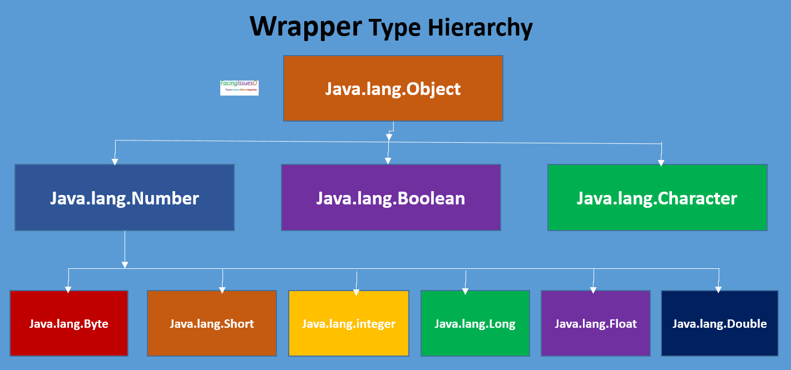
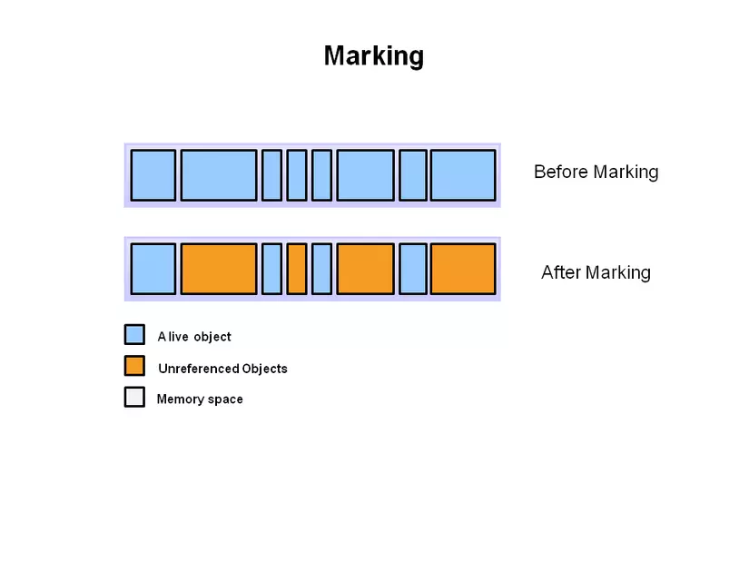
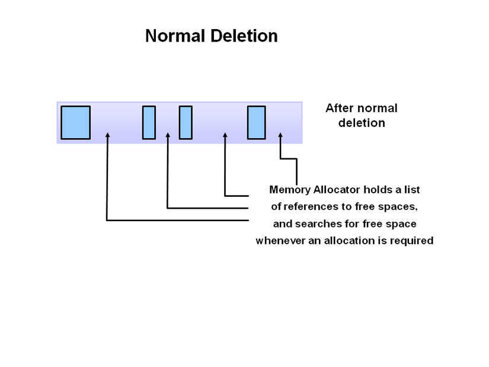
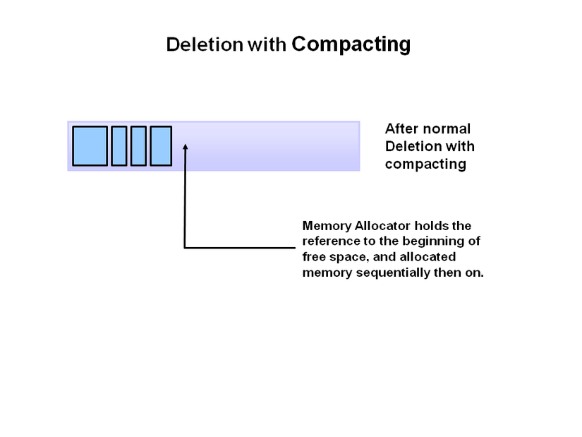
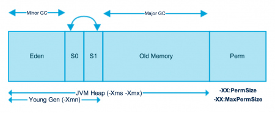
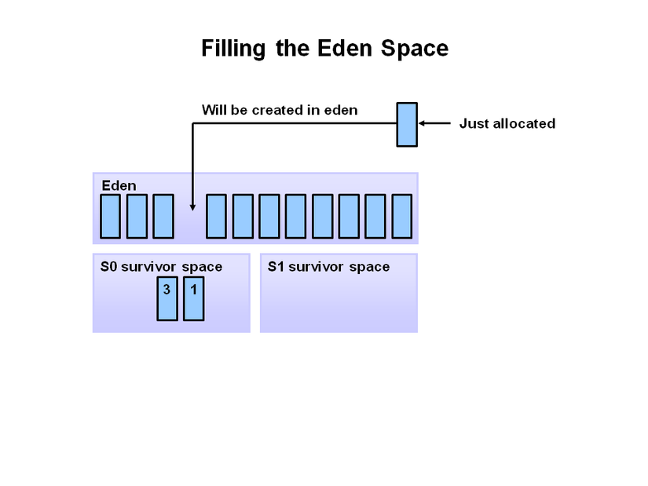
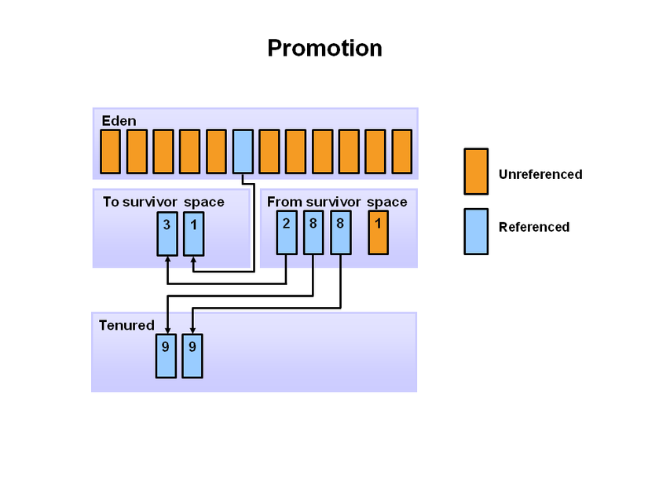

- [\[Buổi 3\] Cách Java lưu trữ dữ liệu](#buổi-3-cách-java-lưu-trữ-dữ-liệu)
  - [1. Cách Java lưu trữ dữ liệu:](#1-cách-java-lưu-trữ-dữ-liệu)
    - [1.1 Kiểu dữ liệu nguyên thuỷ:](#11-kiểu-dữ-liệu-nguyên-thuỷ)
    - [1.2 Kiểu dữ liệu đối tượng:](#12-kiểu-dữ-liệu-đối-tượng)
    - [1.3 Class Object trong Java:](#13-class-object-trong-java)
    - [1.3 Class Wrapper trong Java:](#13-class-wrapper-trong-java)
  - [2. Phương thức khởi tạo (Constructor) trong Java:](#2-phương-thức-khởi-tạo-constructor-trong-java)
    - [2.1 Constructor không có tham số:](#21-constructor-không-có-tham-số)
    - [2.2 Constructor có tham số:](#22-constructor-có-tham-số)
    - [2.3 Từ khóa this trong Java:](#23-từ-khóa-this-trong-java)
    - [2.4 Từ khóa super trong Java:](#24-từ-khóa-super-trong-java)
  - [3. Garbage Collectors trong Java:](#3-garbage-collectors-trong-java)
    - [3.1 Garbage Collectors là gì ?](#31-garbage-collectors-là-gì-)
    - [3.2 Garbage collectors hoạt động như thế nào?](#32-garbage-collectors-hoạt-động-như-thế-nào)
    - [3.3 Ưu và nhược điểm:](#33-ưu-và-nhược-điểm)
  - [4. Pass by value trong Java là gì?](#4-pass-by-value-trong-java-là-gì)

# [Buổi 3] Cách Java lưu trữ dữ liệu

## 1. Cách Java lưu trữ dữ liệu:
- Các kiểu dữ liệu trong java là tập hợp những nhóm dữ liệu với các đặc tính giống nhau. Đồng thời, những dữ liệu này cũng có cách lưu trữ và xử lý như nhau. Nhờ có kiểu dữ liệu mà compiler có thể nhận diện kích thước của biến cũng như hiệu quả lưu trữ của biến.

- Việc sử dụng kiểu dữ liệu trong java giúp hệ điều hành cấp bộ nhớ và từ đó sẽ quyết định dữ liệu nào có thể lưu trữ ở trong bộ nhớ đó. Ví dụ như: biến có kiểu số thức, số nguyên hay ký tự thì hệ điều hành sẽ căn cứ vào đó để xác định vị trí phù hợp để lưu vùng giá trị đó.
- Trong Java, các kiểu dữ liệu được chia thành 2 loại: dữ liệu nguyên thủy và dữ liệu đối tượng. Mỗi loại dữ liệu khác nhau sẽ có các kiểu dữ liệu tương ứng.
### 1.1 Kiểu dữ liệu nguyên thuỷ:
- Có 8 kiểu dữ liệu nguyên thủy (Primitive Data type) đó là: **boolean**, **byte**, **char**, **short**, **int**, **long**, **float**, **double**.
- Trong đó:
  - Kiểu logic: **boolean**.
  - Các kiểu số nguyên: **byte**, **short**, **char**, **int**, **long**.
  - Các kiểu số thực: **float**, **double**.
 
| Kiểu dữ liệu | Giá trị mặc định | Kích thước |
| ------------ | ---------------- | ---------- |
| boolean      | false            | 1 bit      |
| char         | '\u0000'         | 2 byte     |
| byte         | 0                | 1 byte     |
| short        | 0                | 2 byte     |
| int          | 0                | 4 byte     |
| long         | 0L               | 8 byte     |
| float        | 0.0f             | 4 byte     |
### 1.2 Kiểu dữ liệu đối tượng:
Trong Java có 3 kiểu dữ liệu đối tượng phổ biến là:
- **Array**: Đây là mảng các dữ liệu có cùng một  kiểu.
- **Class**: Dữ liệu này có kiểu lớp đối tượng được định nghĩa bởi người dùng. Bên trong nó sẽ chứa tập hợp các thuộc tính cũng như phương thức.
- **Interface**: Dữ liệu này thuộc kiểu lớp giao tiếp được định nghĩa bởi người dùng và chứa các phương thức giao tiếp.

### 1.3 Class Object trong Java:
Tất cả các lớp trong Java đều kế thừa trực tiếp(Đơn kế thừa) hoặc gián tiếp (Kế thừa nhiều cấp) lớp Object hay nói cách khác Objet là lớp cha của tất cả các lớp.


**Các phương thức của lớp Object**
| Phương thức                                                               | Mô tả                                                                                                                                                                  |
| ------------------------------------------------------------------------- | ---------------------------------------------------------------------------------------------------------------------------------------------------------------------- |
| public final Class getClass()                                             | trả về đối tượng lớp Class của đối tượng hiện tại. Từ lớp Class đó có thể lấy được các thông tin metadata của class hiện tại.                                          |
| public int hashCode()                                                     | trả về số hashcode cho đối tượng hiện tại.                                                                                                                             |
| public boolean equals(Object obj)                                         | so sánh đối tượng đã cho với đối tượng hiện tại.                                                                                                                       |
| protected Object clone() throws CloneNotSupportedException                | tạo và trả về bản sao chép (clone) của đối tượng hiện tại.                                                                                                             |
| public String toString()                                                  | trả về chuỗi ký tự đại diện của đối tượng hiện tại.                                                                                                                    |
| public final void notify()                                                | đánh thức một `thread`  , đợi trình giám sát của đối tượng hiện tại.                                                                                                   |
| public final void notifyAll()                                             | đánh thức tất cả các `thread`. đợi trình giám sát của đối tượng hiện tại.                                                                                              |
| public final void wait(long timeout)throws InterruptedException           | làm cho `thread` hiện tại đợi trong khoảng thời gian là số mili giây cụ thể, tới khi Thread khác thông báo (gọi phương thức notify() hoặc notifyAll()).                |
| public final void wait(long timeout,int nanos)throws InterruptedException | làm cho `thread` hiện tại đợi trong khoảng thời gian là số mili giây và nano giây cụ thể, tới khi `thread` khác thông báo (gọi phương thức notify() hoặc notifyAll()). |
| public final void wait()throws InterruptedException                       | làm `thread` hiện tại đợi, tới khi `thread` khác thông báo (gọi phương thức notify() hoặc notifyAll()).                                                                |
| protected void finalize()throws Throwable                                 | Được gọi bởi `Garbage Collector` trước khi đối tượng bị dọn rác.                                                                                                       |

`Trong đó:` Thread là một luồng thực thi trong một chương trình. JVM cho phép một ứng dụng có nhiều luồn thực thi chạy đồng thời.

- **Ví dụ phương thức getClass(), hashCode(), toString(), equals()**
```Java
public class Main {
    public static void main(String args[]) {
        Person p1 = new Person();
        Person p2 = new Person();
        System.out.println(p1.getClass());
        System.out.println(p1.hashCode());
        System.out.println(p1.toString());
        System.out.println(p1.equals(p2));
    }
}
```
```
Output:
class Person
1595428806
Person@5f184fc6
false
```
**Object cloning trong java**
- Object cloning là cách để tạo ra một bản sao chính xác của một đối tượng bị clone. Phương thức clone() được sử dụng để tạo ra một object mới.

- Class của đối tượng mà chúng ta muốn clone phải được `implements` từ `interface` `java.lang.Cloneable`. Nếu chúng ta không `implements interface Cloneable`, phương thức `clone()` sinh ra lỗi ngoại lệ **CloneNotSupportedException**.
- Phương thức phương thức clone() được định nghĩa trong lớp Object có cú pháp như sau:
```Java
protected native Object clone() throws CloneNotSupportedException;
```
- **Tại sao sử dụng phương thức clone()**: Phương thức clone () tiết kiệm tác vụ xử lý bổ sung để tạo ra một bản sao chính xác của một đối tượng. Nếu chúng ta thực hiện nó bằng cách sử dụng từ khoá new sẽ mất rất nhiều tiến trình xử lý được thực hiện, đó là lý do tại sao chúng ta sử dụng object cloning.

**Ví dụ phương thức clone()**
```Java
import java.lang.Cloneable;
public class Student implements Cloneable {
    int rollno;
    String name;

    Student(int rollno, String name) {
        this.rollno = rollno;
        this.name = name;
    }

    public Object clone() throws CloneNotSupportedException {
        return super.clone();
    }

    public static void main(String args[]) {
        try {
            Student s1 = new Student(101, "An");
            Student s2 = (Student) s1.clone();
            System.out.println(s1.rollno + " " + s1.name);
            System.out.println(s2.rollno + " " + s2.name);
        } catch (CloneNotSupportedException c) {
        }
    }
}
```
```
Output:
101 An
101 An
```
`Trong đó:` 
- `import java.lang.Cloneable;` thêm package có chứa `Interface` `Clonable`.
- `implements`: từ khóa nếu Class hiện tại muốn sử dụng những thuộc tính và phương thức của `Interface`, có thể `implements` nhiều `Interface`.
- `throws CloneNotSupportedException`: phương thức có thể ném (throws) ra ngoại lệ `CloneNotSupportedException`.
- `try:` Khi các dòng lệnh có thể sinh ra ngoại lệ (`Exception`), ta sẽ đặt nó trong try để chương trình không bị ảnh hưởng nếu gặp ngoại lệ.
- `catch:` nếu bắt (catch) được ngoại lệ, các lệnh trong catch sẽ được thực thi.
### 1.3 Class Wrapper trong Java:
- Java không phải là một ngôn ngữ lập trình hướng đối tượng thuần túy, lý do là nó hoạt động trên các kiểu dữ liệu nguyên thủy. Tám kiểu dữ liệu nguyên thủy int, short, byte, long, float, double, char và, boolean không phải là đối tượng. Chúng ta sử dụng các lớp trình bao bọc để sử dụng các kiểu dữ liệu này dưới dạng các đối tượng. Lớp Wrapper trong Java làm cho mã Java hoàn toàn hướng đối tượng.

***1.3.1 Class Wrapper trong Java*** 

- Trong quá trình phát triển dự án, chúng ta thường gặp các trường hợp cần có các đối tượng thay vì các kiểu dữ liệu nguyên thủy. Để làm được điều này, Java cung cấp một khái niệm về những lớp Wrapper. Lớp Wrapper trong Java là loại lớp cung cấp một cơ chế để chuyển đổi loại dữ liệu nguyên thủy thành đối tượng và ngược lại. 

- Khi một lớp Wrapper được tạo ra, một tệp mới sẽ được tạo ra và ở đó, chúng ta sẽ lưu trữ các kiểu dữ liệu nguyên thủy. Đối tượng của lớp Wrapper bọc hoặc giữ kiểu dữ liệu nguyên thủy tương ứng của nó.

- Quá trình chuyển đổi các kiểu dữ liệu nguyên thủy thành một đối tượng gọi là `Boxing`. Trong khi sử dụng một lớp Wrapper, bạn chỉ cần truyền giá trị của kiểu dữ liệu nguyên thủy cho phương thức khởi tạo của lớp Wrapper.

Tất cả các lớp Wrapper **Byte**, **Short**, **Integer**, **Long**, **Double** và **Float**, là các lớp con của lớp trừu tượng **Number**. Trong khi các lớp của **Character** và **Boolean** wrapper là các lớp con của lớp **Object**.

**Sơ đồ dưới đây cho thấy thứ bậc của các lớp trình bọc Wrapper:**



| Kiểu dữ liệu ban đầu | Wrapper   | Đối số                |
| -------------------- | --------- | --------------------- |
| boolean              | Boolean   | boolean hoặc String   |
| char                 | Character | char                  |
| byte                 | Byte      | byte hoặc String      |
| short                | Short     | short hoặc String     |
| int                  | Integer   | int hoặc String       |
| long                 | Long      | long hoặc String      |
| float                | Float     | float, double, String |
| double               | Double    | double hoặc String    |

***1.3.2 Tại sao lại cần sử dụng lớp Wrapper trong Java ?***
- Các lớp Wrapper được sử dụng để cung cấp cơ chế “bọc” hoặc ràng buộc các giá trị của kiểu dữ liệu nguyên thủy vào một đối tượng. Điều này giúp các kiểu nguyên thủy hoạt động tương tự như các đối tượng và thực hiện các hoạt động dành riêng cho các đối tượng.
- Các lớp Wrapper cũng được sử dụng để cung cấp nhiều chức năng tiện ích cho các kiểu dữ liệu nguyên thủy như chuyển đổi các kiểu nguyên thủy thành các đối tượng chuỗi và ngược lại, chuyển đổi sang các cơ sở khác nhau như nhị phân, bát phân hoặc thập lục phân hoặc so sánh các đối tượng khác nhau. 
- Chúng ta không thể cung cấp các giá trị null cho các kiểu dữ liệu nguyên thủy nhưng các lớp wrapper có thể là null. Vì vậy, các lớp wrapper có thể được sử dụng trong những trường hợp như vậy chúng ta sẽ cần gán giá trị null cho các kiểu dữ liệu nguyên thủy.
 
***1.3.3 Ưu điểm của việc sử dụng lớp Wrapper trong Java***

- Serialization (Tuần tự hóa) trong Java: Trong Serialization, chúng ta cần chuyển đổi các đối tượng thành các luồng. Nếu chúng ta có một giá trị nguyên thủy và muốn tuần tự hóa chúng thì chúng ta có thể thực hiện việc này bằng cách chuyển đổi chúng với sự trợ giúp của các lớp wrapper.

- Đồng bộ hóa: Trong đa luồng, đồng bộ hóa Java hoạt động với các đối tượng

- Gói java.util: Gói java,util cung cấp nhiều lớp tiện ích để xử lý các đối tượng hơn là các giá trị.

- Collection Framework: Collection Framework trong Java chỉ hoạt động với các đối tượng. Tất cả các lớp của Collection Framework như ArrayList, LinkedList, Vector, HashSet,.... chỉ làm việc với đối tượng.

- Đa hình: Lớp Wrapper cũng giúp đạt được đa hình trong Java.

***1.3.4 Tạo đối tượng Wrapper trong Java***

```Java
public class WrapperDemo

{

  public static void main(String[] args)

  {

    Integer myInt = 10;

    Double myDouble = 11.65;

    Character myChar = 'T';

    Boolean myBool= true;


   System.out.println(myInt);

    System.out.println(myDouble);

    System.out.println(myChar);

    System.out.println(myBool);

  }

}
```

```
Output:
10
11.65
T
true
```

***1.3.5 Autoboxing trong Java***
- Quá trình tự động chuyển đổi các kiểu dữ liệu nguyên thủy thành các đối tượng lớp Wrapper tương ứng được gọi là Autoboxing trong Java. Đây là Autoboxing vì điều này được thực hiện tự động bởi trình biên dịch Java. Ví dụ: char thành Character, int thành Integer, long thành Long, double thành Double, float thành Float, boolean thành Boolean, byte thành Byte và short thành Short.
`Ví dụ:`
```Java
public class WrapperExample1 {
    public static void main(String args[]) {
        // Đổi int thành Integer
        int a = 20;
        Integer i = Integer.valueOf(a);// đổi int thành Integer
        Integer j = a;// autoboxing, tự động đổi int thành Integer trong nội bộ trình biên dịch
 
        System.out.println(a + " " + i + " " + j);
    }
}
```
```
Output:
20 20 20
```

***1.3.6 Unboxing trong Java***

- Java Unboxing là quá trình ngược lại của Autoboxing. Quá trình chuyển đổi đối tượng lớp wrapper thành kiểu dữ liệu nguyên thủy tương ứng của nó được gọi là Java Unboxing.

`Ví dụ: ` 
```Java
public class WrapperExample2 {
    public static void main(String args[]) {
        // đổi Integer thành int
        Integer a = new Integer(3);
        int i = a.intValue();// đổi Integer thành int
        int j = a;// unboxing, tự động đổi Integer thành int trong nội bộ trình biên dịch
 
        System.out.println(a + " " + i + " " + j);
    }
}
```
```
Output:
3 3 3 
```

**Các phương thức của lớp Wrapper trong Java**
|  STT  | Phương thức | Mô tả phương thức                                                                    |
| :---: | :---------- | :----------------------------------------------------------------------------------- |
|   1   | typeValue() | Trả về giá trị đã chuyển đổi của đối tượng Số này thành kiểu dữ liệu được chỉ định.  |
|   2   | compareTo() | So sánh đối tượng Number này với đối số được chỉ định.                               |
|   3   | equals()    | Kiểm tra xem đối tượng Number này có bằng với đối số được chỉ định hay không         |
|   4   | valueOf()   | Trả về một đối tượng Integer chứa giá trị kiểu nguyên thủy đã chỉ định.              |
|   5   | toString()  | Trả về một đối tượng Chuỗi chứa giá trị của một đối số kiểu Số nguyên được chỉ định. |
|   6   | parseInt()  | Truy xuất kiểu dữ liệu nguyên thủy của một chuỗi được chỉ định.                      |
|   7   | abs()       | Trả về giá trị tuyệt đối của đối số được chỉ định.                                   |
|   8   | ceil()      | Trả về số nguyên nhỏ nhất bằng hoặc lớn hơn đối số đã chỉ định ở định dạng kép.      |
|   9   | floor()     | Trả về số nguyên lớn nhất bằng hoặc nhỏ hơn đối số đã chỉ định ở định dạng kép.      |
|  10   | round()     | Trả về long hoặc int gần nhất theo kiểu trả về của phương thức.                      |
|  11   | min()       | Trả về giá trị nhỏ hơn giữa hai đối số.                                              |
|  12   | max()       | Trả về giá trị lớn hơn giữa hai đối số.                                              |
|  13   | exp()       | Trả lại e cho lũy thừa của đối số, tức là cơ số của logarit tự nhiên.                |
|  14   | log()       | Trả về logarit tự nhiên của đối số được chỉ định.                                    |
|  15   | pow()       | Trả về kết quả của đối số đầu tiên được nâng lên thành lũy thừa của đối số thứ hai.  |
## 2. Phương thức khởi tạo (Constructor) trong Java:
- Là một phương thức đặc biệt, phương thức này sẽ tự động được gọi khi bạn khởi tạo một đối tượng  (với các phương thức thông thường thì bạn cần dùng toán tử “.” để gọi tới).
- Constructor có đặc điểm là không được định nghĩa kiểu trả về và có tên trùng với tên lớp.
- Có hai kiểu là không có tham số và có tham số.

`Lưu ý:` Nếu dùng từ khóa private để khai báo constructor thì bạn không thể khởi tạo được đối tượng của lớp này theo cách thông thường.
### 2.1 Constructor không có tham số:
- Nếu một lớp không được khai báo Constructor thì chương trình sẽ tự động tạo một `Constructor mặc định`. Khi ta khai báo 1 Constructor khác Constructor mặc định thì Class sẽ không có Constructor mặc định nữa và nếu muốn sử dụng thì ta phải khai báo như bình thường.
```Java
class MyClass {    
}

public class Entry {
    public static void main(String[] args) {
        MyClass obj = new MyClass();
    }
}
```
- Ta cũng có thể khai báo 1 Constructor không có tham số nhưng có các dòng lệnh ở trong.
```Java
class MyClass {
    // Phương thức khởi tạo của lớp MyClass
    public MyClass() {
        System.out.println("Constructor Called");
    }
}

public class Entry {
    public static void main(String[] args) {
        MyClass obj = new MyClass();
    }
}
```
### 2.2 Constructor có tham số:
- Là một constructor có tham số truyền vào.

`Lưu ý: `Nếu tham số đầu vào trùng với tên thuộc tính của lớp thì bạn có thể truy xuất thuộc tính của lớp bằng từ khóa this và toán tử “.” như sau:
```Java
class Student {
    String name;
    int age;
    public Student(String name, int age) {
        this.name = name;
        this.age = age;
    }
}

public class Entry {
    public static void main(String[] args) {
        Student s1 = new Student("Linh", 24);
    }
}
```
### 2.3 Từ khóa this trong Java:
Trong java, Từ khóa this có 6 cách sử dụng như sau:

- Dùng để tham chiếu tới biến instance của lớp hiện tại.
- Dùng để gọi Constructor của lớp hiện tại.
- Dùng để gọi phương thức của lớp hiện tại.
- Có thể được truyền như một tham số trong phương thức.
- Có thể được truyền như một tham số trong phương Constructor.
- Có thể được dùng để trả về `instance` (thể hiện) của lớp hiện tại.

***2.3.1 Tham chiếu tới biến instance của lớp hiện tại.***
- Nếu tên tham số truyền vào và tên thuộc tính giống nhau thì khi bạn khai báo chương trình sẽ không phân biệt được bạn đang gọi tới cái nào và sẽ sinh ra lỗi như sau:
```Java
public class Student10 {
    int id;
    String name;
 
    Student10(int id, String name) {
        id = id;
        name = name;
    }
 
    void display() {
        System.out.println(id + " " + name);
    }
 
    public static void main(String args[]) {
        Student10 s1 = new Student10(111, "Viet");
        Student10 s2 = new Student10(222, "Nam");
        s1.display();
        s2.display();
    }
}
```
```
Output:
0 null 
0 null
```
- Để giải quyết vấn đề trên, ta sử dụng từ khóa `this` và dấu `.` hoặc đặt tên tham số truyền vào khác với tên thuộc tính.
```Java
public class Student11 {
    int id;
    String name;
 
    Student11(int id, String name) {
        this.id = id;
        this.name = name;
    }
 
    void display() {
        System.out.println(id + " " + name);
    }
 
    public static void main(String args[]) {
        Student11 s1 = new Student11(111, "Viet");
        Student11 s2 = new Student11(222, "Nam");
        s1.display();
        s2.display();
    }
}
```
```
Output:
111 Viet
222 Nam
```
***2.3.2 Sử dụng this() gọi Constructor của lớp hiện tại.***

```Java
public class Student14 {
    int id;
    String name;
    String city;
 
    Student14(int id, String name) {
        this.id = id;
        this.name = name;
    }
 
    Student14(int id, String name, String city) {
        this(id, name);// now no need to initialize id and name
        this.city = city;
    }
 
    void display() {
        System.out.println(id + " " + name + " " + city);
    }
 
    public static void main(String args[]) {
        Student14 e1 = new Student14(111, "Viet");
        Student14 e2 = new Student14(222, "Nam", "Ha Noi");
        e1.display();
        e2.display();
    }
}
```
```
Output:
111 Viet null
222 Nam Ha Noi
```
`Lưu ý: ` this() phải được khai báo dòng lệnh đầu tiên trong Constructor nếu không chương trình sẽ báo lỗi.

***2.3.3 Sử dụng để gọi phương thức của lớp hiện tại.***

```Java
public class Example3 {
    void m() {
        System.out.println("Gọi phương thức bằng từ khóa this");
    }
 
    void n() {
        this.m();
    }
 
    void p() {
        n();// trình biên dịch sẽ thêm this để gọi phương thức n() như this.n()
    }
 
    public static void main(String args[]) {
        Example3 o1 = new Example3();
        o1.p();
    }
}
```

```
Output:
Gọi phương thức bằng từ khóa this
```

***2.3.4 Sử dụng từ khóa this như một tham số của phương thức.***
```Java
public class Example4 {
    void m(Example4 obj) {
        System.out.println("Hello Java");
    }
 
    void p() {
        m(this);
    }
 
    public static void main(String args[]) {
        Example4 o1 = new Example4();
        o1.p();
    }
}
```
***2.3.5 Sử dụng từ khóa this như một tham số của Constructor.***

```Java
class B {  
  A4 obj;  
  B(A4 obj) {  
    this.obj=obj;  
  }  
  void display() {  
    System.out.println(obj.data);// sử dụng biến thành viên cửa lớp A4
  }  
}  
   
class A4 {  
  int data=10;  
  A4(){  
   B b = new B(this);  
   b.display();  
  }  
  public static void main(String args[]) {  
   A4 a = new A4();  
  }  
}
```
```
Output:
10
```

***2.3.6 Sử dụng từ khóa this để trả về instance của lớp hiện tại.***

```Java
class A {  
    A getA() {  
        return this;  
    }  
    void msg() {
        System.out.println("Hello Java");
    }  
}  
   
class Test1 {  
    public static void main(String args[]) {  
        new A().getA().msg();  
    }  
}  
```
```
Output:
Hello Java
```
### 2.4 Từ khóa super trong Java:
- **Từ khóa super trong java** là một biến tham chiếu được sử dụng để tham chiếu trực tiếp đến đối tượng của lớp cha gần nhất.

- Bất cứ khi nào bạn tạo ra instance(thể hiện) của lớp con, một instance của lớp cha được tạo ra ngầm định, nghĩa là được tham chiếu bởi biến super.
 
Trong java, từ khóa super có 3 cách sử dụng như sau:

- sử dụng để tham chiếu trực tiếp đến biến instance của lớp cha gần nhất.
- sử dụng để gọi trực tiếp Constructor của lớp cha.
- sử dụng để gọi trực tiếp phương thức của lớp cha.

***2.4.1 Tham chiếu trực tiếp đến biến instance của lớp cha.***
- Khi lớp con có một thuộc tính có tên giống với lớp cha, nếu ta không sử dụng từ khóa **super** thì chương trình sẽ cho đó là thuộc tính của Class đó. 

```Java
class Vehicle {
    int speed = 50;
}
 
public class Bike2 extends Vehicle {
    int speed = 100;
 
    void display() {
        System.out.println(super.speed);//in speed của lớp Vehicle  
    }
 
    public static void main(String args[]) {
        Bike2 b = new Bike2();
        b.display();
 
    }
}
```
```
Output:
50
```
***2.4.2 Sử dụng super() để gọi trực tiếp Constructor của lớp cha***

```Java
class Vehicle {
    Vehicle() {
        System.out.println("Vehicle is created");
    }
}
 
class Bike2 extends Vehicle {
    Bike2() {
        super();//gọi Constructor của lớp cha  
        System.out.println("Bike is created");
    }
 
    public static void main(String args[]) {
        Bike2 b = new Bike2();
    }
}
```

```
Output:
Vehicle is created
Bike is created
```
`Lưu ý:` Nếu không khởi tạo Constructor của lớp con thì trong Constructor mặc định của lớp con sẽ gọi đến Constructor của lớp Cha.

```Java
class Vehicle {
    Vehicle() {
        System.out.println("Vehicle is created");
    }
}
 
public class Bike6 extends Vehicle {
    int speed;
 
    Bike6(int speed) {
        this.speed = speed;
        System.out.println(speed);
    }
 
    public static void main(String args[]) {
        Bike6 b = new Bike6(10);
    }
}
```

***2.4.3 super() được sử dụng để gọi trực tiếp phương thức của lớp cha.***

```Java
class Person {
    void message() {
        System.out.println("welcome");
    }
}
 
public class Student16 extends Person {
    void message() {
        System.out.println("welcome to java");
    }
 
    void display() {
        message();// gọi phương thức message() của lớp hiện tại
        super.message();// gọi phương thức message() của lớp cha
    }
 
    public static void main(String args[]) {
        Student16 s = new Student16();
        s.display();
    }
}
```

```
Output:
welcome to java
welcome
```
## 3. Garbage Collectors trong Java:
### 3.1 Garbage Collectors là gì ?
- Garbage Collectors (gọi tắt là GC) được định nghĩa như là một quá trình tự động thực thi nhiệm vụ quản lý bộ nhớ. Code Java được dịch sang bytecode rồi chạy trên máy ảo Java hay viết tắt là JVM. 
- Trong quá trình chạy chương trình, các đối tượng được tạo ở vùng nhớ heap, một phần bộ nhớ dành cho chương trình. Sau cùng, sẽ có một vài đối tượng mà chương trình không cần dùng đến. Các đối tượng này sẽ được garbage collector truy tìm và xóa bỏ để thu hồi lại dung lượng bộ nhớ. Khác biệt rất nhiều khi chúng ta làm việc với C/C++.
### 3.2 Garbage collectors hoạt động như thế nào?
- Đầu tiên chúng ta hãy nhớ lại kiến trúc JVM, trong module "Run time area" chúng ta có 2 vùng nhớ là vùng nhớ `Stack` (dùng để lưu trữ tham số và các biến local) và vùng nhớ `Heap` (dùng để lưu trữ các đối tượng sau khi khởi tạo bằng từ khóa `new` và các biến static). Bộ nhớ Heap là bộ nhớ cần dọn dẹp nhất vì các Object không cần dùng nữa phải được xóa bỏ để giải phóng bộ nhớ.
**Ở vùng nhớ Heap được chia làm 3 vùng nhớ nhỏ hơn, tạm gọi là Young generation, Old generation và Permanent generation.**

- **Young generation:** được chia thành nhiều vùng nhớ nhỏ hơn là Eden(khởi tạo) và Survivor(sống sót). Các Object vừa được khởi tạo sẽ nằm ở vùng Eden, sau chu kì quét đầu tiên nếu Object đó còn tồn tại thì sẽ được chuyển sang vùng Survivor. Tại đây cái Object được GC theo dõi liên tục, nếu  như qua nhiều chu kì quét mà Object vẫn còn được sử dụng thì lúc này Object sẽ được chuyển sang vùng nhớ thứ thứ hai.

- **Old generation:** là nơi chứa những Object tòn tại đủ "lâu", còn "lâu" như thế nào thì lại tùy thuộc vào thuật toán của từng bộ GC.
- **Permanent generation:** không chứa Object mà đây là nơi để chứa các metadata của JVM như các class và method của ứng dụng. Do đó nếu các class và method không còn được sử dụng nữa thì GC sẽ coi chúng là "rác" và dọn dẹp nó.
**Quá trình thu gom rác cơ bản thông qua 3 bước sau:**
- **Marking:** Là bước đánh dấu những Object còn sử dụng và những Object không còn sử dụng.
 


- **Normal deleting:** Trình Garbage Collector sẽ xóa cá Object không còn sử dụng.



- **Deletion with Compacting:** Sau khi những Object không còn được sử dụng bị xóa, những Object còn được sử dụng sẽ được "gom" lại gần nhau. Điều đó làm tăng hiệu xuất sử dụng bộ nhớ trống để cấp phát cho những Object mới.



- Để thực hiện việc tự động giải phóng các Object khi chúng không được sử dụng thì bộ nhớ Heap được chia thành các phần nhỏ như hình dưới đây.



- `Young Generation` Là nơi chứa toàn bộ Object mới được khởi tạo. Khi vùng nhớ Young generation đầy thì garbage collectior là Minor GC hoạt động. Vùng Young generation lại được chia thành 3 vùng nhỏ hơn là `Eden` và 2 vùng `Survivor` là `S0`, `S1`.

- Ban đầu mọi Object mới tạo được chứa ở vùng Eden, khi Eden đầy thì Minor GC chuyển chúng sang vùng S0, S1.



- Minor GC liên tục theo dõi các Object ở S0, S1. Sau "nhiều" chu kỳ quét mà Object vẫn còn được sử dùng thì chúng mới được chuyển sang vùng nhớ Old generation. `Old generation` được quản lý bởi garbage collectior khác là Major GC.



### 3.3 Ưu và nhược điểm:

- Trong C++, sau khi khởi tạo một Object, các lập trình viên phải chủ động xóa vùng nhớ của Object bằng câu lệnh delete, nếu như không thực hiện việc này thì sẽ dẫn đến rò rỉ vùng nhớ. Với Garbage Collectors, lập trình viên Java sẽ không cần quan tâm đến việc xóa các Object mỗi lần ra khỏi hàm hay không còn dùng nữa. 
- Tuy nhiên, đánh đổi lại việc đó là hiệu suất của chương trình sẽ bị giảm đáng kể. 
-  Trong khi việc tranh luận về quản lý bộ nhớ tiếp tục nổ ra, Garbage Collectors giờ đây là thành phần tiêu chuẩn của nhiều ngôn ngữ lập trình phổ biến. Đối với các kịch bản nơi các Garbage Collectors ảnh hưởng tiêu cực đến hiệu suất, Java đề xuất nhiều lựa chọn để điều chỉnh cho các tiến trình Garbage Collectors để cải thiện hiệu quả của nó.

## 4. Pass by value trong Java là gì?
- Nếu chúng ta gọi một phương thức và truyền một giá trị cho phương thức đó được gọi là truyền giá trị. Việc thay đổi giá trị chỉ có hiệu lực trong phương thức được gọi, không có hiệu lực bên ngoài phương thức.

```Java
public class Operation1 {
    int data = 50;
 
    void change(int data) {
        data = data + 100;
    }
 
    public static void main(String args[]) {
        Operation1 op = new Operation1();
 
        System.out.println("Trước khi thay đổi: " + op.data);
        op.change(500);
        System.out.println("Sau khi thay đổi: " + op.data);
    }
}
```
```
Output:
Trước khi thay đổi: 50
Sau khi thay đổi: 50
```

